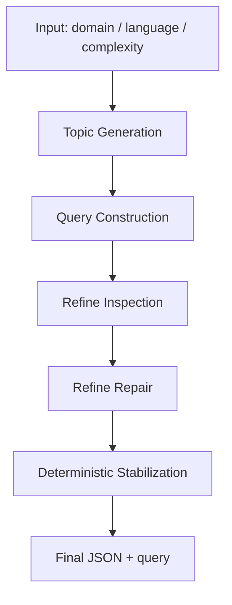

# TVIR Automation Task Generator

<div align="center">

[](https://opensource.org/licenses/MIT)
[](https://www.python.org/downloads/)
[](https://github.com/astral-sh/uv)

</div>

TVIR Automation Task Generator 是一个基于 TVIR 多智能体框架重构而来的自动化任务生成系统。  
它不再以“生成图文研究报告”为主要目标，而是以“生成高质量、可执行、可校验的研究任务描述”为核心输出。

系统输入为：

- `domain`：领域
- `language`：语言
- `complexity`：复杂度

系统输出为一份结构化任务 JSON，其中既包含 `user_role`、`sub_questions`、`multimodal_requirements` 等机器可处理字段，也包含最终可直接交付给研究代理或分析师执行的一段完整 `query`。

---

## 项目定位

这个项目适用于以下场景：

- 为深度研究代理自动生成高质量研究任务
- 为企业/政府/高校/研究机构快速构建任务 brief
- 为 benchmark、评测集、自动化规划系统批量生成标准化 query
- 为下游报告生成器、检索代理、分析代理提供稳定输入

相比普通 prompt 拼接，本项目强调：

- 用户角色明确
- 任务分解清晰
- 研究维度具备深度
- 信息源具备时效性
- 多模态要求真实且可验证

---

## 核心能力

### 1. 三阶段自动化流程

系统按以下三阶段工作：

1. `Topic Generation`
   基于输入领域生成前沿、真实、有研究价值的主题候选。
2. `Query Construction`
   将主题转化为结构化研究任务，生成角色、主任务、研究维度、多模态要求与引用。
3. `Refine + Stabilize`
   对任务结果进行检查、修复和程序级稳定化，保证图片链接、图表来源、时效性检查和最终 `query` 描述尽可能可靠。

### 2. 五项任务设计原则

生成结果围绕以下五项原则约束：

1. 用户特定  
   必须明确指定用户角色，如“某省级生态环境厅大气环境处负责人”“某商业银行数字支付业务主管”。

2. 需求明确  
   任务必须结构化拆解为 3-5 个彼此相关的研究维度。

3. 深度研究  
   每个维度不仅是一个短问题，而是应包含驱动因素、案例、指标、风险、政策、趋势等分析要求。

4. 前沿性  
   优先关注近 2-3 年技术、政策、产业与案例进展，并优先使用 2021 年后的来源。

5. 多模态融合  
   必须包含真实可获取的图片、图表或表格要求，且这些视觉元素服务于分析任务，而不是装饰。

### 3. 双层输出

最终结果同时提供两类输出：

- 结构化 JSON 字段，方便程序消费
- 一段完整专业的 `query`，方便直接交给研究员、LLM 代理或评测系统使用

---

## 输出示例

```json
{
  "user_role": "某商业银行数字支付业务主管",
  "main_task": "评估数字人民币推广策略与场景落地路径",
  "sub_questions": [
    "技术框架与机制升级",
    "国内应用场景与交易活跃度变化",
    "跨境试点、国际竞争与监管风险评估"
  ],
  "multimodal_requirements": [
    {
      "type": "image",
      "description": "数字人民币双层运营架构示意图",
      "source": "https://example.com/architecture.png"
    },
    {
      "type": "chart",
      "description": "累计交易金额与笔数趋势折线图",
      "data_source": "https://example.com/data-report"
    },
    {
      "type": "chart",
      "description": "中国、欧盟、美国CBDC试点阶段与交易规模对比表格",
      "data_source": "https://example.com/cbdc-comparison"
    }
  ],
  "quality_checks": {
    "role_clear": true,
    "sub_questions_coherent": true,
    "timely_sources": true,
    "image_accessible": true,
    "chart_reproducible": true
  },
  "query": "本人作为某商业银行数字支付业务主管，正在撰写一份深度研究报告。请聚焦2023-2025年的最新数据、政策文本与权威文献，围绕数字人民币推广策略与场景落地路径展开系统性研究，结合多源证据进行批判性分析，重点覆盖以下维度：..."
}
```

---

## 项目结构

```text
TVIR/
├─ agent/
│  ├─ main.py                         # 命令行入口
│  ├─ run_agent.sh                    # 快速运行脚本
│  ├─ conf/
│  │  ├─ config.yaml                  # Hydra 主配置
│  │  ├─ agent/
│  │  │  ├─ tvir_agent.yaml           # 自动化任务生成用 agent 编排
│  │  │  └─ default.yaml
│  │  └─ llm/                         # 模型配置
│  ├─ prompts/
│  │  ├─ topic_generation.json
│  │  ├─ query_construction.json
│  │  └─ refine_validation.json
│  └─ src/
│     ├─ core/
│     │  ├─ orchestrator.py           # 三阶段主流程与稳定化逻辑
│     │  ├─ pipeline.py
│     │  └─ automation_utils.py       # 结构规范化、质量检查、query 合成
│     └─ utils/
│        └─ automation_prompt_loader.py
├─ tests/
│  └─ test_automation_utils.py        # 自动化任务生成相关单测
├─ benchmark/                         # 保留的评测与历史能力
├─ libs/
├─ logs/
├─ .env.example
├─ pyproject.toml
└─ README.md
```

---

## 技术架构

### 工作流概览



### 工具职责

- `google_search`
  用于发现前沿主题、政策、论文、案例和图表来源。

- `scrape_website`
  用于验证页面内容、实体、数据来源和可追溯性。

- `google_image_search`
  用于检索可公开访问的真实图片候选。

- `visual_question_answering`
  用于验证图片是否可访问，且内容是否与描述匹配。

---

## 环境要求

- Python `3.12+`
- 推荐使用 [uv](https://github.com/astral-sh/uv) 管理依赖
- Windows / macOS / Linux 均可
- 需要可用的 LLM、搜索、图片检索和 VQA 相关 API

---

## 安装与部署

### 1. 克隆仓库

```bash
git clone https://github.com/<your-org-or-name>/TVIR.git
cd TVIR
```

### 2. 安装 uv

```bash
# macOS / Linux
curl -LsSf https://astral.sh/uv/install.sh | sh

# Windows PowerShell
powershell -c "irm https://astral.sh/uv/install.ps1 | iex"
```

### 3. 安装依赖

```bash
uv sync
```

### 4. 配置环境变量

复制模板文件：

```bash
cp .env.example .env
```

至少需要根据你的部署环境配置以下变量：

```bash
# Search
SERPER_API_KEY=your_serper_key
SERPER_BASE_URL=https://google.serper.dev

# LLM
OPENAI_API_KEY=your_openai_key
OPENAI_BASE_URL=https://api.openai.com/v1

# VQA
VQA_MODEL_NAME=gpt-41-0414-global

# Optional scraping / other providers
JINA_API_KEY=your_jina_key
JINA_BASE_URL=https://r.jina.ai
ANTHROPIC_API_KEY=your_anthropic_key
ANTHROPIC_BASE_URL=https://api.anthropic.com
```

如果你使用仓库内自定义的模型配置，请同步检查：

- [`agent/conf/llm`](agent/conf/llm)
- [`agent/conf/agent`](agent/conf/agent)

---

## 快速开始

### 推荐运行方式

从仓库根目录运行：

```bash
uv run python agent/main.py \
  --domain 环境能源 \
  --language zh \
  --complexity high \
  --llm-config default \
  --agent-config tvir_agent
```

也可以先进入 `agent/` 目录运行：

```bash
cd agent
uv run python main.py \
  --domain 医疗健康 \
  --language zh \
  --complexity medium \
  --llm-config default \
  --agent-config tvir_agent
```

### 参数说明

- `--domain`
  任务领域，如 `环境能源`、`医疗健康`、`金融科技`

- `--language`
  输出语言，可选 `zh` 或 `en`

- `--complexity`
  复杂度，可选 `low` / `medium` / `high`

- `--llm-config`
  使用的 Hydra 模型配置名，默认 `default`

- `--agent-config`
  使用的 agent 编排配置名，默认 `tvir_agent`

### Shell 脚本运行

仓库也提供了简化脚本：

```bash
cd agent
bash run_agent.sh default 环境能源 high zh
```

脚本格式为：

```bash
./run_agent.sh <llm_model> <domain> <complexity> [language]
```

---

## 结果输出

每次运行都会在 `agent/results/<model_name>/automation_<timestamp>/` 下生成结果目录，例如：

```text
agent/results/gpt-4o/automation_20260402_003439/
├─ 01_topic_candidates.json
├─ 02_query_draft.json
├─ 03_refine_review.json
├─ 04_query_repaired.json
├─ 05_refine_recheck.json
├─ 05b_stabilized_query.json
└─ 06_final_task.json
```

其中：

- `01_topic_candidates.json`
  主题候选及选中主题

- `02_query_draft.json`
  初始结构化任务

- `03_refine_review.json`
  质量审查结果

- `04_query_repaired.json`
  修复后的任务结果

- `05b_stabilized_query.json`
  程序级稳定化后的结果

- `06_final_task.json`
  最终输出，可直接给下游代理或研究员使用

---

## 质量检查

最终结果中包含以下质量检查字段：

- `role_clear`
  用户角色是否明确

- `sub_questions_coherent`
  研究维度是否相互关联、支持主任务

- `timely_sources`
  是否优先引用 2021 年后的近期来源

- `image_accessible`
  图片链接是否真实可访问，且内容匹配

- `chart_reproducible`
  图表数据源是否可追溯、可重建

---

## 测试

运行自动化任务生成相关单测：

```bash
uv run python -m pytest tests/test_automation_utils.py
```

这些测试主要覆盖：

- topic 结果规范化
- query 结果规范化
- 质量检查推断
- 完整 `query` 合成逻辑
- 图表类型自动补全与多模态覆盖

---

## 适合二次开发的方向

你可以很方便地在此基础上继续扩展：

- 增加新的领域模板与角色模板
- 增加更多图表类型推断规则
- 引入更严格的来源评分机制
- 把最终输出接入报告生成器或评测系统
- 将 `query` 转成 dataset / benchmark / 自动化任务池

---

## 与原 TVIR 的关系

本仓库保留了 TVIR 的部分历史结构与 benchmark 目录，但当前 README 所描述的主能力已经切换为：

**面向自动化研究任务生成的多智能体 pipeline**

如果你只关心当前主功能，请重点关注：

- [`agent/main.py`](agent/main.py)
- [`agent/src/core/orchestrator.py`](agent/src/core/orchestrator.py)
- [`agent/src/core/automation_utils.py`](agent/src/core/automation_utils.py)
- [`agent/prompts/query_construction.json`](agent/prompts/query_construction.json)

---

## License

This project is licensed under the [MIT License](LICENSE).

---

## Acknowledgement

本项目基于 TVIR 原有多智能体框架重构，并围绕“自动化任务生成”场景进行了重新编排、提示词设计、质量校验与结果稳定化增强。
