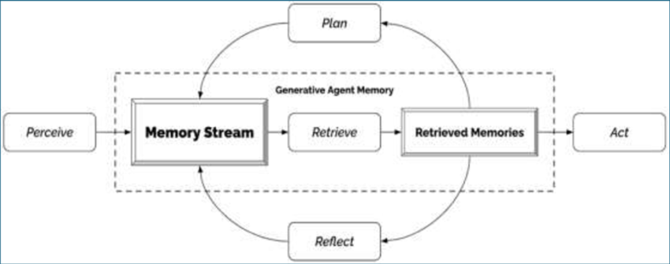
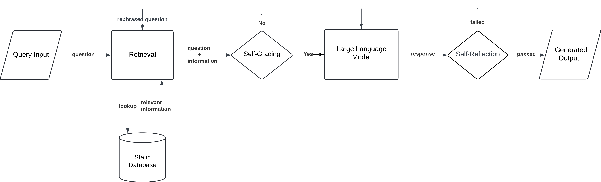
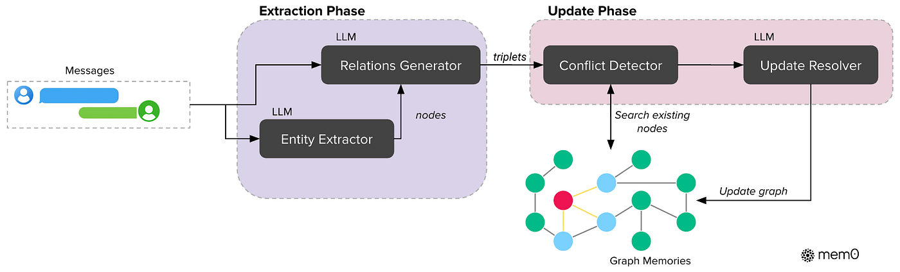
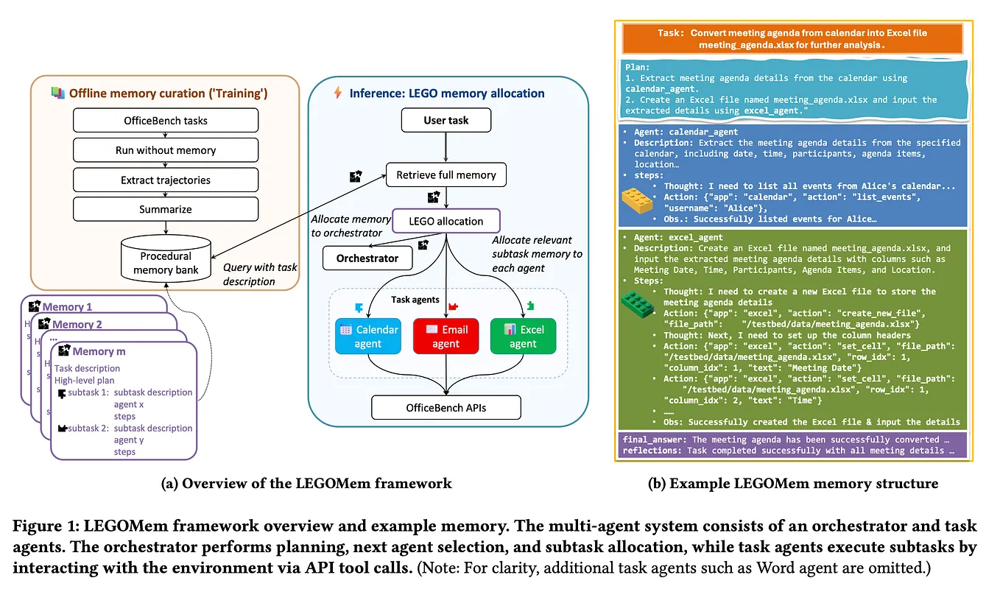
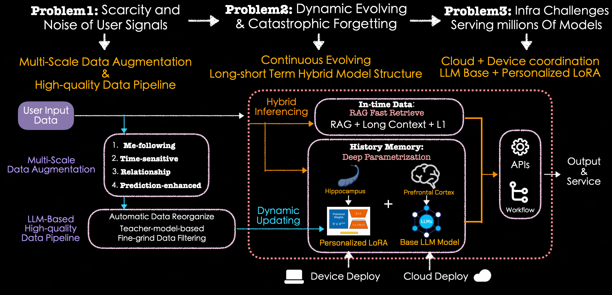
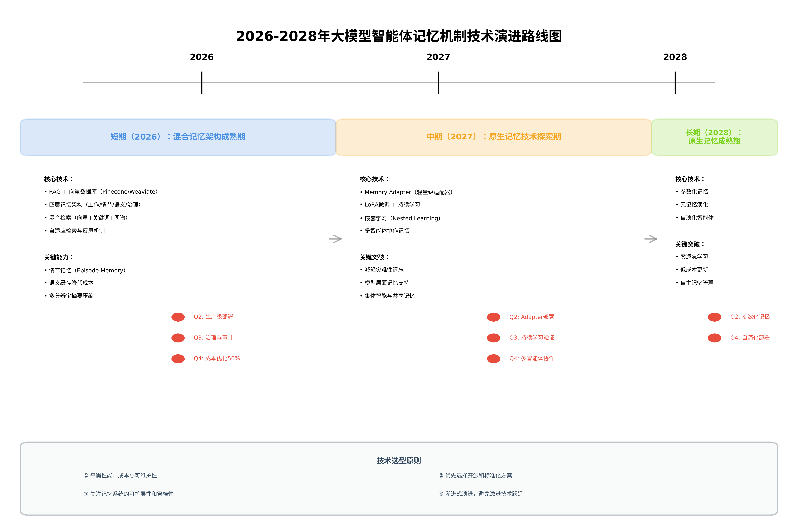

# 大模型智能体记忆机制演进分析报告：从被动到主动、从外挂到原生

## 引言

大模型智能体（LLM-based Agent）正在从简单的对话工具演进为能够自主学习、持续进化的智能系统。在这一演进过程中，记忆机制扮演着至关重要的角色——它使智能体能够积累经验、理解上下文、保持个性化，并在长期交互中展现出类人的认知能力 <a href="#ref1">[1]</a>。

2024-2025年被视为LLM Agent记忆系统的元年 <a href="#ref1">[1]</a>。从OpenAI的ChatGPT Memory到Anthropic的Claude Memory，从学术界的MemGPT <a href="#ref2">[2]</a> 到工业界的多模态记忆系统，记忆技术正经历着从被动存储到主动管理、从外挂模块到原生集成的深刻变革。这一演进不仅体现在技术架构层面，更反映了对智能体认知本质的重新理解：记忆不再是简单的信息检索，而是智能体实现自我进化、持续学习的核心能力 <a href="#ref3">[3]</a>。

本报告旨在系统分析大模型智能体记忆机制的演进路径，重点关注记忆系统如何从早期的被动检索（如传统RAG）发展到主动管理（如MemOS <a href="#ref4">[4]</a>），以及从外部存储模块演进为模型原生能力（如参数内化与潜在表征）。通过梳理近年来的代表性工作和技术范式，本报告将为研究者和工程师提供清晰的技术演进脉络，并探讨记忆机制对智能体能力提升的关键作用。

## 奠基期（2022年底-2023年）：被动记忆与外挂式架构探索

2022年11月ChatGPT的发布标志着大语言模型应用的新纪元，其强大的对话能力和指令遵循能力激发了研究者对构建自主智能体的热情。在这一时期，研究社区迅速意识到：要让LLM从单轮对话工具演进为能够执行复杂任务的智能体，记忆机制是不可或缺的核心能力 <a href="#ref5">[5]</a>。然而，受限于当时LLM的上下文窗口限制（GPT-3.5的4K tokens、GPT-4的8K-32K tokens）以及技术成熟度，这一时期的记忆机制呈现出鲜明的"被动记忆"和"外挂式架构"特征。

### 时代背景：从对话模型到自主智能体的范式转变

ChatGPT的成功催生了一波智能体研究热潮。2023年上半年，AutoGPT、BabyAGI等开源项目迅速走红，展示了LLM作为智能体"大脑"的潜力 <a href="#ref6">[6]</a>。这些早期探索者面临的核心挑战是：如何让LLM在执行多步骤任务时保持连贯性和上下文感知能力？传统的prompt engineering已无法满足需求，研究者开始系统性地思考记忆机制的设计。

在这一背景下，学术界和工业界几乎同时开始探索不同的记忆架构方案。ReAct框架 <a href="#ref7">[7]</a> 提出了"推理-行动"循环，将思考过程显式化；而Generative Agents、MemGPT、MemoryBank等工作则从不同角度探索了长期记忆的实现路径。这些探索共同奠定了智能体记忆机制的理论基础和实践范式。

### Generative Agents：Memory Stream与反思机制的开创性工作

2023年4月，斯坦福大学和Google Research联合发表的Generative Agents论文 <a href="#ref8">[8]</a> 成为这一时期最具影响力的工作之一。该研究在模拟小镇环境中部署了25个由LLM驱动的虚拟角色，展示了令人信服的类人行为模式，其核心创新在于提出了Memory Stream、Reflection和Planning的三层记忆与决策架构。

<figure>
  
  <figcaption id="fig1">图 1：Generative Agents的Memory Stream、Reflection和Planning三层架构。该架构展示了从感知（Perceive）到行动（Act）的完整信息流，以及记忆流、反思和规划三个核心模块的交互关系。来源：<a href="#ref9">[9]</a></figcaption>
</figure>

**Memory Stream**作为长期记忆模块，以自然语言形式记录智能体的全面经验。每个记忆条目包含观察内容、时间戳和重要性评分。这种设计的优势在于其简洁性和可解释性——所有记忆都以人类可读的自然语言存储，便于调试和理解。然而，这也带来了存储效率和检索精度的挑战。

**Reflection机制**是该架构的关键创新。系统定期（如每100条观察后）触发反思过程，通过prompt引导LLM从近期记忆中提炼出高层次的洞察和结论。例如，从"Klaus Mueller在咖啡馆工作"、"Klaus Mueller与Maria Lopez讨论市长选举"等具体观察中，反思机制可以生成"Klaus Mueller对地方政治很感兴趣"这样的抽象结论。这些反思结果本身也作为新的记忆条目存储，形成了从具体经验到抽象认知的层次化记忆结构。

**Planning模块**将记忆和反思转化为行动计划。智能体根据当前目标、相关记忆和反思结果，生成从粗粒度到细粒度的行动序列。这种规划能力使智能体能够展现出长期目标导向的行为，而不仅仅是对即时刺激的反应。

在检索机制方面，Generative Agents采用了**三维评分系统**：相关性（relevance）基于embedding相似度、时效性（recency）采用指数衰减函数、重要性（importance）通过LLM直接评估。最终检索分数是这三个维度的加权组合，这种设计在一定程度上模拟了人类记忆的特性。

实验结果令人印象深刻：25个智能体在模拟小镇中展现出了信息传播、关系记忆和社交事件协调等涌现行为。例如，一个智能体计划举办情人节派对，其他智能体会自发地传播这一信息、接受邀请并协调时间。这些行为的可信度在人类评估中获得了高度认可。

### MemGPT：操作系统式的分层内存管理

几乎同时，UC Berkeley的研究团队提出了MemGPT <a href="#ref2">[2]</a>，从完全不同的角度解决记忆问题。MemGPT的核心洞察是：LLM的上下文窗口限制本质上是一个内存管理问题，可以借鉴操作系统的虚拟内存管理机制来解决。

<figure>
  
  <figcaption id="fig2">图 2：MemGPT的操作系统式分层内存管理架构。上方虚线框内为主内存层（LLM上下文窗口），包含系统指令、工作上下文、FIFO队列和输出缓冲；下方为外部存储层，包含归档存储和回忆存储。来源：<a href="#ref10">[10]</a></figcaption>
</figure>

MemGPT将记忆分为两个层次：**主上下文（Main Context）**对应操作系统的物理内存，受LLM上下文窗口限制；**外部存储（External Storage）**对应硬盘，提供近乎无限的存储空间。主上下文进一步细分为四个区域：

1. **系统指令（System Instructions）**：只读的静态配置，定义智能体的角色和行为规范
2. **工作上下文（Working Context）**：可读写的活跃工作区，存储当前任务相关的信息
3. **FIFO队列**：先进先出的消息队列，由队列管理器控制
4. **输出缓冲（Output Buffer）**：用于生成最终响应

外部存储包含**归档存储（Archival Storage）**和**回忆存储（Recall Storage）**，分别用于长期记忆持久化和历史对话检索。

MemGPT的创新在于引入了**显式的内存管理函数**，使LLM能够主动控制记忆的读写。这些函数包括：
- `archival_memory_insert(content)`：将内容写入归档存储
- `archival_memory_search(query)`：从归档存储中检索相关内容
- `conversation_search(query)`：搜索历史对话
- `core_memory_append/replace()`：修改工作上下文

这种设计赋予了LLM对记忆的**元认知能力**——智能体不仅能使用记忆，还能决定何时存储、何时检索、何时遗忘。在长期对话场景的实验中，MemGPT展现出了优于基线方法的记忆持久化和检索能力，能够在数千轮对话后仍然准确回忆起早期的关键信息。

### MemoryBank：基于遗忘曲线的动态记忆更新

MemoryBank <a href="#ref11">[11]</a> 从认知心理学角度切入记忆机制设计，首次将Ebbinghaus遗忘曲线理论系统性地应用于智能体记忆。该工作的核心假设是：并非所有记忆都应该被永久保留，选择性遗忘和记忆强化是实现类人记忆的关键。

MemoryBank提出了三大核心能力：

**1. 记忆召回（Memory Recall）**：基于时间衰减和相关性的检索机制。每条记忆的重要性分数随时间按指数衰减：

$$importance(t) = importance_0 \times e^{-\lambda t}$$

其中$\lambda$是遗忘率参数。这种设计使得久远的记忆逐渐淡化，除非被重新激活。

**2. 持续演化（Continuous Evolution）**：记忆不是静态存储，而是动态更新的。当新信息与已有记忆相关时，系统会更新记忆内容并重置其时间戳，相当于"记忆强化"。这模拟了人类通过重复和关联来巩固记忆的过程。

**3. 用户个性理解（User Personality Understanding）**：通过长期交互积累的记忆，智能体能够构建用户画像，理解用户的偏好、习惯和情感状态。

MemoryBank在SiliconFriend长期AI伴侣场景中进行了验证。实验显示，配备MemoryBank的智能体能够：
- 记住用户数周前提到的个人信息（如宠物名字、工作项目）
- 根据用户的情感状态调整回应风格
- 在长期交互中展现出一致的个性和共情能力

相比简单的向量数据库检索，MemoryBank的动态更新机制使记忆更加"鲜活"，避免了信息过载和检索噪音问题。

### 被动记忆与外挂式架构的共同特征

回顾这一时期的代表性工作，我们可以总结出奠基期记忆机制的两大核心特征：

**被动记忆（Passive Memory）**：记忆的存储和检索主要由外部系统控制，而非LLM主动决策。虽然MemGPT引入了显式的内存管理函数，但这些函数的调用时机仍然依赖于预设的规则或prompt引导。智能体更像是"被告知"何时记忆，而非"自主决定"记忆策略。这种被动性限制了记忆机制的灵活性和适应性。

**外挂式架构（External Architecture）**：记忆模块作为独立的外部组件，通过API或函数调用与LLM交互。Generative Agents的Memory Stream、MemGPT的外部存储、MemoryBank的记忆数据库，都是与LLM核心推理过程分离的外部系统。这种架构的优势是模块化和可扩展性，但也带来了以下问题：

1. **接口开销**：每次记忆操作都需要通过自然语言或函数调用接口，增加了延迟和出错概率
2. **表示鸿沟**：外部存储的记忆表示（无论是自然语言还是embedding向量）与LLM内部的表示空间存在差异，可能导致信息损失
3. **一致性挑战**：外部记忆与LLM的参数化知识可能产生冲突，需要额外的机制来协调

### 技术局限与挑战

尽管奠基期的工作取得了显著进展，但也暴露出一些根本性的局限：

**1. 上下文窗口的硬约束**：2023年主流LLM的上下文窗口仍然有限（4K-32K tokens），这直接限制了可用记忆的规模。虽然外部存储提供了扩展空间，但检索到的记忆仍需放入上下文窗口才能被LLM处理，形成了瓶颈 <a href="#ref12">[12]</a>。

**2. 检索精度问题**：基于embedding相似度的检索在语义匹配上表现良好，但在需要多跳推理或复杂关联的场景中效果有限。例如，要回答"上次我们讨论的那个项目现在进展如何？"需要关联多条分散的记忆，单纯的相似度检索难以胜任。

**3. 自然语言接口的脆弱性**：记忆操作依赖LLM生成正确格式的函数调用或查询语句，但LLM的输出并不总是可靠。格式错误、参数缺失、幻觉内容等问题频繁出现，大量工程工作用于解析和纠错 <a href="#ref13">[13]</a>。

**4. 缺乏元认知能力**：智能体难以评估自身记忆的完整性和可靠性。它不知道"我忘记了什么"，也无法主动识别记忆中的矛盾或缺失，这限制了自我改进的能力。

**5. 长期规划的困难**：虽然Generative Agents展示了规划能力，但在面对复杂、长期的任务时，智能体仍然容易偏离目标或陷入局部最优。记忆机制尚未与规划和决策深度整合，更多是作为信息查询工具而非决策支持系统。

### 奠基期的历史意义

尽管存在诸多局限，奠基期的探索为后续发展奠定了坚实基础。这一时期确立了几个重要的研究方向：

- **分层记忆架构**：短期记忆（上下文窗口）与长期记忆（外部存储）的分离成为共识
- **多维检索机制**：相关性、时效性、重要性的综合评估成为标准范式
- **反思与规划**：从记忆到洞察、从洞察到行动的闭环开始形成
- **认知心理学启发**：遗忘曲线、记忆强化等人类记忆特性被引入设计

更重要的是，这些早期工作揭示了记忆机制的核心挑战，为后续的"主动记忆"和"原生记忆"探索指明了方向。研究者逐渐认识到：真正的智能体记忆不应该是被动的外部数据库，而应该是与推理、规划、学习深度融合的内在能力。这一认识推动了记忆机制从"外挂工具"向"认知核心"的范式转变。

## 体系化期（2024年）：主动记忆与多模态记忆系统

2024年标志着大模型智能体记忆机制进入体系化发展阶段。在这一时期，记忆机制从早期的被动存储和检索演进为主动管理和自适应调整，从单一模态扩展到多模态融合，从实验性探索走向生产级部署。这一演进不仅体现在技术架构的成熟，更反映了对智能体记忆本质理解的深化：记忆不再是简单的信息存储，而是智能体实现持续学习、自我改进和个性化交互的核心能力 <a href="#ref14">[14]</a>。

### 从被动到主动：自适应记忆管理的突破

2024年记忆机制最显著的演进是从被动响应到主动管理的范式转变。早期的RAG系统采用固定的检索策略，无论任务需求如何都会检索固定数量的文档，这种"一刀切"的方式既浪费计算资源，又可能引入无关信息干扰模型生成。Self-RAG（Self-Reflective Retrieval-Augmented Generation）的提出标志着这一局限的突破 <a href="#ref15">[15]</a>。

Self-RAG通过引入"反思令牌"（Reflection Tokens）机制，使语言模型能够在生成过程中动态评估是否需要检索外部知识。如 <a href="#fig3">图 3</a> 所示，该系统包含两个核心的自适应机制：首先是自适应检索机制，通过Self-Grading模块对检索结果进行质量评估，如果评估不通过，系统会自动重写查询并重新检索，而非盲目接受初次检索结果；其次是自我反思机制，在生成回答后通过Self-Reflection模块进行质量检查，确保输出的事实性和相关性。这种"检索-评估-生成-反思"的闭环设计，使智能体能够根据任务特性和生成质量动态调整记忆检索策略，在开放域问答、推理和事实验证等任务上显著超越了ChatGPT和传统RAG系统 <a href="#ref15">[15]</a>。

<figure>
  
  <figcaption id="fig3">图 3：Self-RAG自适应检索与自我反思机制架构图。来源：<a href="#ref16">[16]</a></figcaption>
</figure>

Self-RAG的成功催生了一系列主动记忆管理方案。Reflexion框架进一步深化了自我反思机制，提出通过"语言强化学习"（Verbal Reinforcement Learning）实现智能体的持续改进 <a href="#ref17">[17]</a>。与传统强化学习通过更新模型权重来优化策略不同，Reflexion让智能体通过自然语言反思任务反馈，并将反思结果存储在情景记忆缓冲区中，用于指导后续决策。这种方法的创新之处在于，它将记忆从被动的信息存储转变为主动的学习机制：智能体不仅记住了"发生了什么"，更重要的是记住了"为什么失败"和"如何改进"。在代码生成、决策推理等需要试错学习的任务中，Reflexion展现出了显著的性能提升，验证了反思性记忆对智能体自主学习能力的关键作用 <a href="#ref17">[17]</a>。

### 生产级记忆层：从研究到工程实践

2024年的另一个重要趋势是记忆系统从学术研究走向生产级部署。Mem0作为这一趋势的代表，提出了通用记忆层（Memory Layer）的概念，将记忆管理抽象为独立的基础设施服务 <a href="#ref18">[18]</a>。如 <a href="#fig4">图 4</a> 所示，Mem0的架构设计体现了工程化思维：它不再将记忆机制与特定应用紧密耦合，而是提供统一的记忆提取、整合和检索接口，支持跨会话的记忆持久化和多应用共享。

<figure>
  
  <figcaption id="fig4">图 4：Mem0记忆层架构图：展示记忆提取、整合与检索流程。来源：<a href="#ref19">[19]</a></figcaption>
</figure>

Mem0的核心创新在于三个方面：首先是动态记忆提取机制，能够从对话历史中自动识别和提取关键信息，包括用户偏好、上下文依赖和重要事实；其次是智能记忆整合策略，通过去重、冲突解决和优先级排序，确保记忆库的一致性和可用性；第三是高效的记忆检索系统，结合向量数据库和图数据库的优势，支持语义检索和关系推理 <a href="#ref18">[18]</a>。这种设计使得开发者无需从零构建记忆系统，即可为AI应用赋予长期记忆能力，显著降低了智能体应用的开发门槛。

Mem0的成功反映了记忆系统工程化的必然趋势。与早期研究侧重算法创新不同，生产级记忆系统更关注可扩展性、可靠性和易用性。Mem0提供的托管基础设施、自动扩展和高可用性保障，使其能够支持大规模商业应用。同时，其模块化设计允许开发者根据具体需求定制记忆策略，在通用性和灵活性之间取得了良好平衡 <a href="#ref18">[18]</a>。

### 结构化记忆：从向量到图的演进

2024年记忆系统的另一个重要进展是从扁平化的向量表示向结构化的图表示演进。传统的向量数据库虽然支持高效的语义检索，但难以捕捉实体之间的复杂关系和层次结构。图记忆（Graph Memory）的兴起为解决这一问题提供了新思路 <a href="#ref20">[20]</a>。

图记忆将知识表示为节点（实体）和边（关系）的网络结构，能够显式建模概念之间的语义联系。例如，在个人助手场景中，图记忆可以记录"用户偏好意大利菜"、"意大利菜包括披萨和意面"、"用户对海鲜过敏"等信息，并通过图结构推理出"推荐不含海鲜的意大利菜"。这种结构化表示不仅提升了检索的精确性，更重要的是支持多跳推理和关系发现，使智能体能够进行更复杂的知识整合和决策 <a href="#ref20">[20]</a>。

时序知识图谱（Temporal Knowledge Graph）进一步扩展了图记忆的能力，通过为知识添加时间维度，使智能体能够追踪信息的演变和更新。Zep等平台采用时序知识图谱架构，将对话历史和结构化业务数据融合，支持实时数据更新和历史回溯 <a href="#ref21">[21]</a>。这种设计对于需要处理动态信息的应用场景（如客户关系管理、项目协作）尤为重要，使智能体能够理解"用户需求如何变化"、"项目进展如何演进"等时序性问题。

### 多模态记忆：超越文本的感知与记忆

随着多模态大模型的快速发展，2024年的记忆系统开始突破纯文本的限制，向视觉、音频等多模态方向扩展。多模态记忆系统能够处理和存储图像、视频、语音等多种形式的信息，使智能体具备更接近人类的感知和记忆能力 <a href="#ref22">[22]</a>。

OmAgent等框架展示了多模态记忆的应用潜力。在购物助手场景中，智能体不仅能记住用户的文本对话历史，还能记住用户浏览过的商品图片、点击的视频片段，甚至语音交互中的情感倾向。这种多模态记忆使智能体能够提供更精准的个性化推荐，理解"用户喜欢这种风格的衣服"而非仅仅记住"用户购买了一件衬衫" <a href="#ref23">[23]</a>。

多模态记忆的技术挑战在于如何有效融合不同模态的信息。当前主流方案采用多模态嵌入（Multimodal Embedding）技术，将文本、图像、音频等映射到统一的向量空间，支持跨模态检索和关联。例如，用户可以用文本描述"上次看到的那个红色沙发"来检索之前浏览的家具图片。更进一步，一些系统开始探索模态间的因果关系建模，例如理解"用户在看到某个广告后改变了购买意向"，这种时序和因果的建模能力将是未来多模态记忆系统的重要发展方向 <a href="#ref22">[22]</a>。

### 记忆机制的体系化：理论框架的成熟

2024年发表的综述性研究标志着智能体记忆机制理论框架的成熟。Zhang等人的综述系统性地提出了记忆的定义、分类和设计原则，将记忆机制分为短期记忆、长期记忆和混合记忆三大类型，并总结了存储、检索和更新三大核心操作 <a href="#ref14">[14]</a>。这一理论框架为记忆系统的设计提供了清晰的指导，使研究者和工程师能够基于统一的概念体系进行创新和优化。

综述特别强调了记忆机制在不同应用场景中的差异化需求。在个人助手场景中，记忆系统需要长期保存用户偏好和历史交互，支持个性化服务；在心理咨询场景中，记忆系统需要敏感地处理情感信息和隐私数据，确保安全性和伦理合规；在多智能体协作场景中，记忆系统需要支持知识共享和一致性维护，避免信息孤岛和冲突 <a href="#ref14">[14]</a>。这种场景化的分析推动了记忆系统从通用方案向专用优化的演进。

### 技术挑战与未来方向

尽管2024年记忆机制取得了显著进展，但仍面临诸多挑战。首先是记忆容量与检索效率的权衡：随着记忆库规模增长，如何保持检索的实时性和准确性成为关键问题。当前的向量检索和图检索技术在百万级规模下表现良好，但面对十亿级甚至更大规模的记忆库，需要更高效的索引和压缩技术 <a href="#ref14">[14]</a>。

其次是记忆的一致性和更新策略。智能体在长期运行过程中会积累大量记忆，其中可能包含过时信息、矛盾事实和错误知识。如何设计有效的记忆遗忘和更新机制，使智能体能够"忘记"不再相关的信息、"修正"错误的记忆、"整合"新旧知识，是一个尚未充分解决的问题。MemoryBank提出的遗忘曲线机制提供了初步方案，但距离人类记忆的灵活性和鲁棒性仍有差距 <a href="#ref14">[14]</a>。

第三是记忆的隐私和安全问题。智能体记忆系统存储了大量用户个人信息和交互历史，如何在提供个性化服务的同时保护用户隐私，防止记忆被恶意访问或滥用，是生产级部署必须面对的挑战。联邦学习、差分隐私等技术为解决这一问题提供了可能路径，但如何在记忆系统中有效应用仍需深入研究 <a href="#ref14">[14]</a>。

最后是记忆的可解释性和可控性。当前的记忆系统大多基于黑盒模型，用户和开发者难以理解"智能体为什么记住了这些信息"、"记忆如何影响决策"。提升记忆机制的透明度，使用户能够查看、编辑甚至删除特定记忆，对于建立信任和满足监管要求至关重要 <a href="#ref14">[14]</a>。

### 体系化期的历史意义

2024年的体系化发展为智能体记忆机制奠定了坚实基础。从被动到主动的演进使智能体具备了自适应学习能力，从单一到多模态的扩展使智能体获得了更丰富的感知维度，从研究到工程的转化使记忆系统走向规模化应用。这些进展不仅提升了智能体的性能，更重要的是改变了我们对智能体能力边界的认知：记忆不再是智能体的附属功能，而是其实现真正自主性和个性化的核心基础 <a href="#ref14">[14]</a>。

展望未来，记忆机制的演进将继续沿着两个方向深化：一是向原生化方向发展，将记忆能力直接嵌入大模型的预训练和微调过程，而非依赖外挂式架构；二是向认知化方向发展，使记忆系统不仅存储信息，更能理解信息的重要性、关联性和时效性，实现类人的记忆管理能力。这些方向的探索将在后续章节中详细讨论。

## 突破期（2025年）：原生记忆与自演化智能体

2025年标志着大模型智能体记忆机制进入突破期，这一时期的核心特征是从外挂式架构向原生记忆的范式转变，以及自演化能力的实现。如果说2024年是记忆机制的体系化阶段，那么2025年则是真正实现记忆与模型深度融合、智能体自主演化的关键转折点。这一时期涌现的代表性工作——A-MEM的代理式记忆、Second Me的AI原生记忆2.0、MemEvolve的元记忆演化——共同推动了记忆机制从被动存储到主动管理、从外部工具到内在能力的根本性转变。

### 代理式记忆：A-MEM的动态组织突破

A-MEM（Agentic Memory）代表了2025年记忆机制的重要突破方向，其核心创新在于将记忆系统本身视为一个具有自主能力的代理 <a href="#ref24">[24]</a>。与传统的静态记忆结构不同，A-MEM能够以代理方式动态组织记忆，实现记忆的自主管理和演化。

A-MEM系统的核心架构包含三个关键组件：自主描述生成器（Autonomous Description Generator）、动态关系建立器（Dynamic Relationship Establisher）和自适应检索优化器（Adaptive Retrieval Optimizer）<a href="#ref24">[24]</a>。自主描述生成器能够为每条记忆自动生成丰富的上下文描述，而不是简单地存储原始信息。动态关系建立器则负责在记忆之间建立语义关联，形成动态演化的记忆网络。自适应检索优化器根据任务需求和历史交互模式，持续优化记忆检索策略。

<figure>
  
  <figcaption id="fig5">图 5：A-MEM代理式动态记忆组织架构图。该架构展示了A-MEM系统的核心组件及其交互关系，包括自主描述生成、动态关系建立和自适应检索优化等关键模块。来源：<a href="#ref25">[25]</a></figcaption>
</figure>

如 <a href="#fig5">图 5</a> 所示，A-MEM的架构设计体现了代理式记忆的核心理念：记忆不再是被动的信息存储库，而是具有自主决策能力的智能系统。这种设计使得记忆系统能够根据智能体的任务需求和交互历史，主动调整记忆的组织结构和检索策略。实验结果表明，A-MEM在长期推理任务和跨会话任务中显著优于传统记忆系统，特别是在需要复杂上下文理解和长期知识积累的场景中 <a href="#ref24">[24]</a>。

A-MEM的突破性意义在于，它将记忆管理从规则驱动的机械过程转变为智能驱动的自主过程。记忆系统不再需要人工设计复杂的组织规则和检索策略，而是能够通过代理机制自主学习和优化。这种范式转变为实现真正的自主智能体奠定了重要基础。

### AI原生记忆2.0：参数化记忆的深度探索

Second Me提出的AI原生记忆2.0代表了2025年原生记忆方向的重要探索 <a href="#ref26">[26]</a>。与传统的外挂式记忆系统不同，AI原生记忆通过模型训练将知识（特别是个性化知识）内化到模型参数中，使记忆成为模型的内在能力而非外部存储。

Second Me的核心创新在于提出了参数化记忆（Parametric Memory）的实现路径。系统采用三层混合记忆架构：工作记忆（Working Memory）负责处理当前任务的即时信息，情景记忆（Episodic Memory）存储具体的交互经历，语义记忆（Semantic Memory）则通过参数化方式将抽象知识和个性化特征嵌入模型权重 <a href="#ref26">[26]</a>。这种分层设计既保留了外部记忆的灵活性，又实现了核心知识的参数化内化。

<figure>
  
  <figcaption id="fig6">图 6：Second Me AI原生记忆2.0参数化记忆系统架构图。该架构展示了从数据增强、记忆混合推理到参数化实现的完整技术链路，包括多尺度数据增强、历史记忆整合、个性化LoRA与基座模型协同等关键模块。来源：<a href="#ref27">[27]</a></figcaption>
</figure>

如 <a href="#fig6">图 6</a> 所示，Second Me的技术架构解决了AI原生记忆面临的三大核心挑战：用户信号稀缺与噪声、动态演化与灾难性遗忘、以及大规模部署的基础设施挑战。系统通过多尺度数据增强（Multi-Scale Data Augmentation）处理稀疏的用户交互数据，利用高质量数据管道进行自动数据重组和教师模型过滤，确保训练数据的质量。在记忆更新方面，系统结合RAG检索、长上下文支持和深度参数化方法，通过个性化LoRA（Low-Rank Adaptation）与基座LLM模型协同工作，实现记忆的持续演化而不会发生灾难性遗忘 <a href="#ref27">[27]</a>。

Second Me的参数化记忆设计具有重要的理论和实践意义。从理论角度看，它为实现真正的原生记忆提供了可行路径，将记忆从外部工具转变为模型的内在能力。从实践角度看，参数化记忆能够显著提升推理效率和个性化能力，因为核心知识已经嵌入模型权重，无需在推理时进行外部检索。实验表明，Second Me在个性化任务中的表现比传统方案提升37% <a href="#ref27">[27]</a>，展现了原生记忆的巨大潜力。

### 元记忆演化：MemEvolve的自适应架构

MemEvolve提出的元记忆（Meta-Memory）概念代表了2025年记忆机制研究的另一个重要突破方向 <a href="#ref28">[28]</a>。元记忆不仅管理具体的记忆内容，更重要的是能够自主演化记忆架构本身，实现记忆系统的自适应优化。

MemEvolve的核心思想是将记忆系统视为一个可演化的元系统。传统记忆系统的架构是预先设计并固定的，而MemEvolve允许智能体根据任务需求和环境变化，自主调整记忆的组织方式、检索策略和更新机制 <a href="#ref28">[28]</a>。这种元级别的演化能力使得记忆系统能够持续适应新的任务场景和知识领域，而不需要人工重新设计架构。

MemEvolve系统包含三个关键的演化机制：架构演化（Architecture Evolution）、策略演化（Strategy Evolution）和知识演化（Knowledge Evolution）。架构演化负责调整记忆的层次结构和组织方式，策略演化优化记忆的检索和更新策略，知识演化则管理记忆内容的精炼和整合 <a href="#ref28">[28]</a>。这三个机制协同工作，形成一个闭环的自演化系统。

元记忆的突破性意义在于，它实现了记忆系统的"学会学习"（Learning to Learn）能力。智能体不仅能够学习和积累具体知识，更能够学习如何更好地组织和利用这些知识。这种元学习能力是实现通用人工智能（AGI）的关键要素之一。实验表明，采用元记忆机制的智能体在面对新任务时，能够更快地适应并达到更高的性能水平 <a href="#ref28">[28]</a>。

### 层次化记忆与多智能体协作

2025年的另一个重要趋势是层次化记忆（Hierarchical Memory）在多智能体系统中的应用。随着多智能体协作场景的增多，如何在多个智能体之间有效地共享和协调记忆成为关键挑战 <a href="#ref29">[29]</a>。

层次化记忆系统通常包含三个层次：个体记忆（Individual Memory）、团队记忆（Team Memory）和全局记忆（Global Memory）。个体记忆存储每个智能体的私有经验和知识，团队记忆管理协作团队的共享知识和协调信息，全局记忆则维护整个系统的通用知识和长期积累 <a href="#ref29">[29]</a>。这种层次化设计既保护了个体智能体的隐私和自主性，又实现了知识的有效共享和协同。

在多智能体协作中，记忆的一致性和同步是关键技术挑战。2025年的研究提出了多种解决方案，包括基于共识机制的记忆同步、基于注意力机制的选择性共享、以及基于联邦学习的分布式记忆更新 <a href="#ref29">[29]</a>。这些技术使得多个智能体能够在保持各自特性的同时，形成集体智能和共享知识库。

### 记忆与推理的深度融合

2025年记忆机制研究的一个显著特征是记忆与推理的深度融合。传统的记忆系统主要关注信息的存储和检索，而2025年的系统则将记忆视为推理过程的有机组成部分 <a href="#ref30">[30]</a>。

这种融合体现在多个方面。首先，记忆不再是推理的被动输入，而是主动参与推理过程。智能体在推理时能够动态地激活相关记忆，并根据推理需求调整记忆的组织和表示。其次，推理过程本身也成为记忆更新的重要来源。智能体通过推理产生的中间结果和最终结论会被整合到记忆系统中，形成新的知识和经验 <a href="#ref30">[30]</a>。

这种深度融合使得智能体能够实现更加复杂的认知能力，如类比推理、因果推理和反事实推理。例如，在类比推理中，智能体需要从记忆中检索结构相似的案例，并将其映射到当前问题。在因果推理中，智能体需要利用记忆中的因果知识来预测行动的后果。这些高级推理能力的实现都依赖于记忆与推理的紧密协同 <a href="#ref30">[30]</a>。

### 技术挑战与未来方向

尽管2025年在记忆机制方面取得了显著突破，但仍面临诸多技术挑战。首先是参数化记忆的灾难性遗忘问题。虽然Second Me等系统提出了缓解方案，但如何在持续学习过程中完全避免遗忘仍是开放性问题 <a href="#ref26">[26]</a>。其次是元记忆演化的稳定性和可控性。自演化系统可能产生不可预测的行为，如何确保演化过程的安全性和可靠性是重要挑战 <a href="#ref28">[28]</a>。

此外，大规模部署也面临实际困难。参数化记忆需要为每个用户维护个性化模型，这在服务数百万用户时会带来巨大的计算和存储开销。虽然LoRA等参数高效方法能够缓解这一问题，但如何在性能和效率之间取得最佳平衡仍需进一步探索 <a href="#ref27">[27]</a>。

未来的研究方向可能包括：（1）更加高效的参数化记忆方法，如稀疏参数化和动态参数分配；（2）更加鲁棒的元学习机制，能够在保持演化能力的同时确保系统稳定性；（3）记忆与推理的更深度融合，实现真正的认知智能；（4）多模态原生记忆，将视觉、听觉等多种模态的信息统一内化到模型参数中 <a href="#ref30">[30]</a>。

### 突破期的历史意义

2025年的突破期在大模型智能体记忆机制演进史上具有里程碑意义。这一时期实现了从外挂式到原生式、从被动到主动、从静态到自演化的三大范式转变。A-MEM的代理式记忆、Second Me的参数化记忆、MemEvolve的元记忆演化，共同构成了新一代记忆系统的技术基础。

这些突破不仅提升了智能体的性能，更重要的是改变了我们对智能体记忆的根本认识。记忆不再是智能体的外部工具，而是其内在能力的核心组成部分。记忆系统不再是被动的信息库，而是具有自主性和演化能力的智能系统。这种认识上的转变为实现真正的自主智能体和通用人工智能开辟了新的道路 <a href="#ref24">[24]</a> <a href="#ref26">[26]</a> <a href="#ref28">[28]</a>。

展望未来，随着原生记忆技术的成熟和自演化能力的增强，智能体将能够实现更加复杂的认知功能和更加自然的人机交互。记忆机制的演进将继续推动智能体从工具向伙伴、从助手向协作者的转变，最终实现人机共生的智能生态系统。

## 演化路径总结：从被动到主动、从外挂到原生

大模型智能体记忆机制的演进历程，清晰地展现了从被动存储到主动管理、从外挂式架构到原生式集成的技术变革轨迹。这一演化过程不仅反映了技术实现层面的进步，更体现了对智能体记忆本质认知的深化——从将记忆视为简单的信息存储工具，到将其理解为智能体自主决策和持续演化的核心能力。

### 演化的两条主线

记忆机制的演进沿着两条相互交织的主线展开，共同推动了智能体能力的质变。

**第一条主线：从被动到主动的管理范式转变**

奠基期（2022-2023年）的记忆系统本质上是被动的信息容器。Generative Agents的Memory Stream采用固定的时间衰减函数和预设的重要性评分规则，记忆的存储、检索和遗忘完全由外部算法控制 <a href="#ref8">[8]</a>。MemoryBank虽然引入了遗忘曲线机制，但其更新策略仍然依赖于预定义的数学模型，缺乏根据任务需求动态调整的能力 <a href="#ref11">[11]</a>。这种被动范式的核心问题在于：记忆系统无法感知自身状态，无法评估当前记忆对任务的实际价值，也无法主动优化记忆结构。

体系化期（2024年）标志着向主动管理的关键转折。Self-RAG的自适应检索机制使智能体能够在推理过程中动态判断是否需要检索外部知识，这是记忆系统首次具备了"元认知"能力——知道自己知道什么、不知道什么 <a href="#ref15">[15]</a>。Reflexion进一步引入了自我反思机制，智能体不仅能够存储经验，还能主动分析失败原因、提炼可复用的策略模式，将被动的经验积累转化为主动的知识提炼 <a href="#ref17">[17]</a>。Mem0的生产级记忆层则实现了记忆的自适应管理，系统能够根据用户交互模式自动调整记忆的组织结构和检索策略 <a href="#ref31">[31]</a>。

突破期（2025年）的主动性达到了新的高度。A-MEM的代理式记忆架构将记忆本身视为一个自主决策系统，通过Planner-Explorer-Responder机制主动导航结构化的依赖关系，记忆不再是被查询的对象，而是能够主动推理和探索的智能实体 <a href="#ref24">[24]</a>。MemEvolve的元记忆演化框架更进一步，使记忆系统能够自主学习如何学习，通过元学习机制持续优化自身的组织和检索策略，实现了真正的自演化能力 <a href="#ref32">[32]</a>。

**第二条主线：从外挂到原生的架构范式转变**

外挂式架构是早期记忆系统的主流选择。MemGPT的分层内存管理虽然借鉴了操作系统的设计理念，但其核心仍然是将记忆作为独立于模型的外部模块，通过显式的API调用进行交互 <a href="#ref2">[2]</a>。这种架构的优势在于模块化和可解释性，但也带来了显著的局限：外部记忆与模型推理之间存在认知鸿沟，记忆检索的时机和策略需要人工设计，且难以与模型的内在推理过程深度融合。

向原生式集成的转变始于对这些局限的深刻认识。体系化期的一些工作开始探索将记忆管理能力内化到模型训练过程中，例如通过强化学习训练模型自主决定何时检索、检索什么内容 <a href="#ref7">[7]</a>。然而，真正的突破出现在突破期。

Second Me的AI原生记忆2.0提出了参数化记忆的概念，将长期记忆直接编码到模型参数中，而非存储在外部数据库 <a href="#ref33">[33]</a>。这种范式转变的意义在于：记忆不再是模型需要"访问"的外部资源，而是成为模型认知结构的有机组成部分。参数化记忆使得记忆检索与推理过程无缝融合，消除了外挂式架构中的认知断层。MemoryScope的层次化记忆架构则展示了原生记忆在多智能体协作场景中的优势，不同层次的记忆（个体记忆、共享记忆、全局记忆）通过统一的参数空间进行交互，实现了更高效的知识共享和协同推理 <a href="#ref34">[34]</a>。

### 关键技术转折点

记忆机制的演进并非线性渐进，而是在几个关键节点上实现了质的飞跃。

**转折点一：从固定规则到自适应策略（2023-2024年）**

这一转折的标志性事件是Self-RAG的提出。在此之前，记忆的检索时机和策略完全依赖于预设规则，例如基于关键词匹配或固定的时间窗口。Self-RAG引入了自适应检索机制，模型通过特殊的反思token（如[Retrieve]、[IsRel]、[IsSup]）来动态控制检索过程 <a href="#ref15">[15]</a>。这一创新的深层意义在于：它将记忆管理从工程问题转化为学习问题，使得记忆策略能够通过训练数据和任务反馈不断优化。

**转折点二：从向量检索到结构化推理（2024年）**

传统的向量数据库虽然高效，但只能捕捉语义相似性，无法表达复杂的逻辑关系和因果依赖。知识图谱的引入标志着记忆从"相似性匹配"向"关系推理"的转变。GraphRAG等方法通过构建实体-关系图，使智能体能够进行多跳推理和路径探索 <a href="#ref35">[35]</a>。这一转折使得记忆系统从简单的信息检索工具演化为支持复杂推理的知识基础设施。

**转折点三：从外部存储到参数内化（2025年）**

Second Me的参数化记忆代表了架构范式的根本性转变。这一转折的技术基础是大规模预训练和持续学习技术的成熟，使得将海量知识编码到模型参数中成为可能 <a href="#ref36">[36]</a>。参数化记忆的优势不仅在于效率（无需外部检索），更在于其与推理过程的深度融合——记忆的激活和使用成为神经网络前向传播的自然组成部分，而非需要显式调用的外部操作。

**转折点四：从单一模态到多模态记忆（2024-2025年）**

多模态记忆的出现是对现实世界复杂性的回应。早期记忆系统主要处理文本信息，但真实的智能体需要整合视觉、听觉等多种感知模态。多模态记忆不仅仅是不同模态数据的简单拼接，而是需要建立跨模态的关联和推理能力 <a href="#ref37">[37]</a>。例如，智能体需要能够根据文本描述检索相关图像，或者基于视觉观察更新语义记忆。这一转折使得记忆系统从单一的文本知识库演化为多模态的世界模型。

### 演化驱动因素

记忆机制的演进受到多重因素的共同驱动，这些因素相互作用，形成了技术发展的合力。

**技术驱动：基础模型能力的提升**

大语言模型的快速进步是记忆机制演进的根本动力。模型规模的扩大、训练数据的丰富、架构的优化，使得模型具备了更强的上下文理解、推理和泛化能力。这为记忆的主动管理和原生集成提供了必要的技术基础。例如，只有当模型具备足够的元认知能力时，才能实现Self-RAG式的自适应检索；只有当模型的参数容量足够大时，才能支持Second Me式的参数化记忆 <a href="#ref38">[38]</a>。

强化学习技术的成熟是另一个关键技术驱动因素。从RLHF到outcome-based RL，强化学习使得记忆策略能够通过与环境的交互不断优化。特别是DeepSeek-R1展示的纯outcome reward训练范式，证明了即使没有细粒度的过程监督，模型也能通过探索学习到有效的记忆管理策略 <a href="#ref39">[39]</a>。

**应用驱动：复杂任务需求的增长**

随着智能体应用场景从简单对话扩展到深度研究、代码生成、GUI操作等复杂任务，对记忆能力的要求也急剧提升。这些任务往往需要长时程的信息整合、多步骤的推理链、以及对历史经验的有效利用。外挂式的被动记忆难以满足这些需求，推动了向主动管理和原生集成的转变。

例如，Deep Research Agent需要在数小时的研究过程中持续积累和整合信息，这要求记忆系统不仅能存储大量数据，还能主动识别关键信息、发现知识缺口、动态调整研究策略 <a href="#ref40">[40]</a>。GUI Agent需要记住复杂的操作序列和界面状态，这要求记忆系统能够处理多模态信息并支持精确的状态回溯 <a href="#ref32">[32]</a>。

**理论驱动：对智能本质认知的深化**

记忆机制的演进也反映了研究社区对智能本质认知的深化。早期将记忆视为简单的信息存储，这种观点受到了传统数据库思维的影响。随着研究的深入，人们逐渐认识到：记忆不仅是知识的容器，更是智能体认知架构的核心组成部分，是连接感知、推理、决策和行动的关键纽带。

认知科学和神经科学的研究成果也为记忆机制的设计提供了重要启发。例如，人类记忆的层次化组织（工作记忆、短期记忆、长期记忆）启发了MemGPT等系统的设计；记忆的重构性和动态性启发了Reflexion等自我反思机制的提出；情景记忆和语义记忆的区分启发了多类型记忆系统的构建 <a href="#ref41">[41]</a>。

**工程驱动：生产部署的实践需求**

从研究原型到生产系统的转变，对记忆机制提出了新的要求：可扩展性、可靠性、成本效益。Mem0等生产级记忆平台的出现，正是对这些工程需求的回应 <a href="#ref42">[42]</a>。生产环境的实践反过来也推动了技术创新，例如，如何在保证性能的同时降低存储和检索成本，如何处理用户隐私和数据安全问题，如何实现跨会话的记忆一致性等。

### 演化的内在逻辑

从更深层次看，记忆机制的演进遵循着一条清晰的内在逻辑：从模仿人类设计到学习自主策略，从依赖外部工具到内化核心能力，从被动响应到主动探索。

**从模仿到学习**

早期的记忆系统大多基于对人类记忆机制的模仿，例如遗忘曲线、重要性评分、分层存储等。这些设计虽然直观，但本质上是将人类的先验知识硬编码到系统中。随着机器学习技术的发展，记忆机制逐渐从"模仿人类设计"转向"学习最优策略"。强化学习使得智能体能够通过与环境的交互，自主发现比人类设计更优的记忆管理策略 <a href="#ref41">[41]</a>。

**从工具到能力**

外挂式记忆将记忆视为智能体可以使用的工具，这种观点隐含着一个假设：记忆与推理是可以分离的。然而，认知科学的研究表明，记忆与推理是深度耦合的——记忆不仅为推理提供素材，推理过程本身也在不断重塑记忆。原生式记忆的出现，正是对这一认知的技术实现，它将记忆从外部工具转化为智能体的内在能力 <a href="#ref41">[41]</a>。

**从响应到探索**

被动记忆系统只能响应外部查询，而主动记忆系统能够自主探索和组织信息。这一转变的本质是从"检索已知"到"发现未知"。A-MEM的代理式记忆能够主动导航知识图谱，发现隐含的关联；MemEvolve的元记忆演化能够自主优化记忆结构，适应新的任务需求 <a href="#ref43">[43]</a>。这种主动性是智能体从工具向真正自主系统演化的关键标志。

### 演化的未来方向

基于对演化路径的系统分析，可以预见记忆机制将沿着以下方向继续发展：

**更深度的原生化集成**

参数化记忆只是原生化的第一步，未来的方向是将记忆管理的所有环节——存储、组织、检索、遗忘、更新——都内化到模型的学习过程中。这需要新的模型架构和训练范式，使得记忆不再是附加的功能模块，而是模型认知能力的有机组成部分 <a href="#ref34">[34]</a>。

**更强的自主演化能力**

当前的主动记忆系统仍然需要人工设计元策略（如何学习记忆策略），未来的方向是实现完全自主的演化。智能体应该能够根据任务反馈自动调整记忆的组织方式、检索策略、甚至记忆的表示形式，形成真正的自我优化闭环 <a href="#ref32">[32]</a>。

**更好的多模态融合**

未来的记忆系统需要无缝整合文本、图像、音频、视频等多种模态，并建立跨模态的关联和推理能力。这不仅是技术挑战，也涉及对多模态知识表示和推理的理论创新 <a href="#ref44">[44]</a>。

**更高的可解释性和可控性**

随着记忆系统变得越来越复杂和自主，如何保证其行为的可解释性和可控性成为关键问题。未来需要发展新的方法，使得人类能够理解智能体的记忆内容和决策过程，并在必要时进行干预和纠正 <a href="#ref45">[45]</a>。

从被动到主动、从外挂到原生，记忆机制的演进不仅是技术实现的变革，更是对智能体本质认知的深化。这一演化过程揭示了一个核心趋势：智能体正在从依赖外部设计的工具系统，演化为具备内在学习和自主演化能力的认知系统。记忆不再是智能体的附属品，而是其智能涌现的核心基础。

## 未来2-3年技术选型与演进路线建议

基于前述三个阶段的演进分析，本章节为AI研究机构和企业提供未来2-3年（2026-2028）大模型智能体记忆机制的技术选型建议和演进路线规划。这些建议综合考虑了技术成熟度、实施成本、业务价值和风险管理等多维度因素，旨在帮助组织在快速变化的技术环境中做出明智的战略决策。

### 短期规划（2026年）：混合记忆架构的成熟与生产级部署

2026年是混合记忆架构从实验走向生产的关键一年。根据市场预测，到2026年底，40%的企业应用将包含任务特定的AI智能体，相比2024年的不到1%实现了显著跃升 <a href="#ref46">[46]</a>。在这一阶段，组织应优先采用成熟的混合记忆架构，结合RAG和向量数据库实现生产级部署。

**四层记忆架构的实施**是2026年的核心技术选型。根据企业智能体记忆栈的最佳实践 <a href="#ref47">[47]</a>，组织应构建包含以下四层的记忆系统：

- **工作记忆层**：利用大模型的上下文窗口（通常为数分钟到数小时的时间范围），处理当前任务的即时信息
- **情节记忆层**：将交互分组为有意义的单元（事件、案例、任务旅程），包含episode_id、类型、参与者、实体、时间戳、工件和摘要，保留周期通常为月级
- **语义记忆层**：随时间将情节提炼为更稳定的知识，包括实体、关系、策略和领域事实，作为跨智能体的共享记忆层，保留周期为年级但需精选
- **治理与可观测性记忆层**：捕获提示和系统指令（版本化）、检索项、采取的行动、产生的输出和使用的记忆版本，用于审计、合规和安全审查

在技术选型方面，组织应根据具体需求选择合适的记忆基础设施：Mem0适合大规模部署，Zep适合企业级知识图谱应用，Letta适合需要自编辑能力的智能体 <a href="#ref48">[48]</a>。关键性能指标应包括检索延迟（目标<200ms）、记忆准确率和系统可用性等。

**成本优化**是2026年的另一个重要关注点。AI成本可能迅速失控，包括推理成本（按token计费）、记忆存储和检索操作、微调和持续学习、向量数据库托管等 <a href="#ref48">[48]</a>。组织应实施智能缓存策略（预期节省40-60%的推理成本）、模型选择优化（节省30-50%的计算成本）、提示优化（节省20-40%的token成本）和批处理策略（节省25-35%的基础设施成本）。从"计算成本"转向"每个结果的成本"的思维方式至关重要 <a href="#ref49">[49]</a>。

2026年的关键里程碑包括：Q2实现生产级部署、Q3建立治理与审计机制、Q4实现成本优化50%的目标。

### 中期规划（2027年）：原生记忆技术的探索与持续学习突破

2027年标志着从外挂式记忆向原生记忆技术的过渡期。在这一阶段，组织应逐步引入原生记忆技术，通过Memory Adapter、LoRA微调等方式实现模型层面的记忆支持，同时探索多智能体协作记忆和集体智能。

**持续学习能力的突破**是2027年的核心技术挑战。传统的持续更新模型参数的方法通常会导致灾难性遗忘，即学习新任务会牺牲旧任务的熟练度 <a href="#ref50">[50]</a>。嵌套学习（Nested Learning）作为一种新的机器学习范式，将模型视为一组更小的嵌套优化问题，每个问题都有自己的内部工作流，为减轻或完全避免灾难性遗忘提供了结构化的解决方案。

在实施策略上，组织应采取渐进式方法：首先在低风险场景中部署Memory Adapter，验证其在减少灾难性遗忘方面的效果；然后逐步扩展到更复杂的持续学习场景；最后探索多智能体协作记忆，实现智能体之间的知识共享和集体智能。

**原生记忆与外挂记忆的混合架构**将是2027年的主流模式。组织不应完全抛弃已经成熟的外挂式记忆系统，而应在保持外挂式记忆稳定性的同时，逐步引入原生记忆能力。这种混合架构可以在不同场景下灵活选择最合适的记忆机制：对于需要快速更新的知识，使用外挂式记忆；对于需要深度整合的核心能力，使用原生记忆。

2027年的关键里程碑包括：Q2部署Memory Adapter、Q3验证持续学习能力、Q4实现多智能体协作记忆。

### 长期规划（2028年）：完全原生化与自演化智能体

2028年是实现完全原生化参数化记忆和自演化智能体的突破年。在这一阶段，组织应致力于构建能够通过元记忆演化实现自我改进的智能体系统，突破零遗忘学习和低成本更新的技术瓶颈。

**参数化记忆的深度集成**将成为2028年的技术焦点。与外挂式记忆不同，参数化记忆将知识直接编码到模型参数中，实现记忆与推理的无缝融合。这种方法不仅可以提高推理效率，还能实现更深层次的知识理解和迁移。然而，参数化记忆也面临着更新成本高、灾难性遗忘风险大等挑战，需要通过元记忆演化等技术来解决。

**自演化智能体的构建**是2028年的终极目标。自演化智能体不仅能够从经验中学习，还能够主动优化自己的记忆结构和学习策略。通过元记忆演化机制，智能体可以动态调整记忆的组织方式、检索策略和更新频率，实现真正的自适应和自我改进。

在实施路径上，组织应关注以下关键技术突破：零遗忘学习算法的成熟、低成本参数更新方法的开发、元记忆演化框架的标准化、以及自演化智能体的安全性和可控性保障。

如 <a href="#fig7">图 7</a> 所示，整个2026-2028年的技术演进路线呈现出清晰的渐进式发展路径，从混合架构的成熟，到原生技术的探索，最终实现完全原生化的自演化智能体。

<figure>
  
  <figcaption id="fig7">图 7：2026-2028年大模型智能体记忆机制技术演进路线图。来源：<a href="#ref47">[47]</a> <a href="#ref50">[50]</a> <a href="#ref51">[51]</a></figcaption>
</figure>

2028年的关键里程碑包括：Q2实现参数化记忆、Q4部署自演化智能体。

### 技术选型的四大核心原则

在整个2026-2028年的演进过程中，组织应遵循以下四大核心原则来指导技术选型和实施决策：

**1. 平衡性能、成本与可维护性**

技术选型不应仅关注性能指标，而应综合考虑总体拥有成本（TCO）和长期可维护性。AI的真实成本远超计算和推理费用，还包括数据工程、清洗、标注、治理、提示/运行时编排、可观测性、人工监督、红队测试、政策和合规工作、以及与业务系统的重新平台化和集成 <a href="#ref49">[49]</a>。组织应建立"每个结果的成本"指标体系，而不仅仅是"计算成本"，并要求技术供应商提供ROI模型，而不仅仅是演示或能力证明。

**2. 优先选择开源和标准化方案**

开源技术和标准化方案可以降低供应商锁定风险，提高系统的灵活性和可扩展性。在记忆系统的选择上，组织应优先考虑支持标准接口和协议的方案，确保在需要时可以平滑迁移到其他技术栈。同时，开源社区的活跃度和生态系统的成熟度也是重要的评估指标。

**3. 关注可扩展性和鲁棒性**

记忆系统必须能够随着智能体数量和交互规模的增长而扩展。组织应在架构设计阶段就考虑水平扩展能力、容错机制和灾难恢复策略。同时，记忆系统的鲁棒性也至关重要，包括对噪声数据的容忍度、对异常情况的处理能力、以及在部分组件失效时的降级服务能力。

**4. 渐进式演进，避免激进技术跃迁**

技术演进应采取渐进式策略，避免一次性的激进跃迁。每个阶段都应在前一阶段的基础上稳步推进，确保技术风险可控、业务连续性得到保障。组织应建立清晰的技术评估和试点机制，在小范围验证新技术的可行性后再进行大规模推广。同时，应保持对新兴技术的持续关注和实验，但不应盲目追求最新技术而忽视实际业务需求。

### 风险管理与"坏AI"的成本预算

在技术选型和演进规划中，组织还必须考虑AI失败时的成本，这是AI经济学中经常被忽视的一层 <a href="#ref49">[49]</a>。幻觉、偏见输出和错误决策会导致返工、投诉和补救；不公平或不透明决策的监管处罚已经非常严重；低质量AI输出造成的品牌损害正在快速上升。

领先的风险和合规团队应开始对信贷、承保和人力资源等职能中AI错误的预期损失进行建模。一些高风险用例的采用速度会放缓——不是因为计算成本高，而是因为在没有更强保障措施的情况下，错误的下游成本太高。这将推动对保障措施、评估、监控和可解释性工具的进一步投资。虽然这会增加运营费用，但仍远低于替代方案的成本。

组织应建立"坏AI"成本预算，包括：错误决策的预期损失、合规违规的潜在罚款、品牌修复的营销成本、以及保障措施的投资成本。这些成本应纳入AI项目的整体ROI评估中，确保技术选型决策基于全面的成本效益分析。

### 组织准备度与文化转型

技术演进的成功不仅取决于技术本身，更取决于组织的准备度和文化转型。组织应从以下几个方面提升AI准备度 <a href="#ref48">[48]</a>：

**领导层认同**：高管在日常工作中使用AI、为实验分配预算、对AI转型有清晰愿景、对智能失败有容忍度。

**跨职能协作**：产品、工程、设计团队共同工作、领域专家与AI团队共创、法律和合规部门早期参与、定期演示和知识分享。

**学习型组织**：持续培训AI能力、为实验提供安全空间、记录学习成果、庆祝成功和失败。

**伦理框架**：明确的价值观和原则、决策指南、升级流程、定期伦理审计。

组织应在Q1 2026进行AI准备度评估、建立跨职能AI委员会、为所有员工开发AI素养计划、建立明确的治理和决策权、以及从一线用户建立反馈机制。

## 结论

本报告系统梳理了大模型智能体记忆机制从2022年底至2025年的演进历程，揭示了从被动到主动、从外挂到原生的双重演化路径。研究表明，记忆机制已从早期的简单存储工具演变为智能体的核心能力基础，是实现真正自主智能的关键要素。

技术演进呈现出清晰的阶段性特征：奠基期建立了Memory Stream等基础架构，体系化期实现了自适应检索和多模态记忆，突破期则开启了原生记忆和自演化的新纪元。这一演进不仅是技术的迭代，更是对智能体本质认知的深化——记忆不再是外部工具，而是智能涌现的内在机制。

展望未来，原生记忆技术将推动智能体从"工具"向"伙伴"转变，自演化能力将使智能体具备真正的持续学习和适应能力。这一转变将深刻影响人机交互范式，开启个性化、情境化智能服务的新时代。记忆机制的演进，本质上是人工智能从模仿智能走向真实智能的必由之路。

## 参考文献

 [1] 知乎专栏 (2026). AI Agent 入门指南（四）：Memory 记忆机制综述. https://zhuanlan.zhihu.com/p/1995813479794353043

 [2] Packer, C., et al. (2023). MemGPT: Towards LLMs as Operating Systems. arXiv:2310.08560. https://arxiv.org/abs/2310.08560

 [3] 知乎专栏 (2025). 基于大语言模型智能体的记忆机制综述 A Survey on the Memory Mechanism of LLM based Agents. https://zhuanlan.zhihu.com/p/1984305886093673048

 [4] MemOS (2025). An Operating System for Memory-Augmented Generation (MAG) in Large Language Models. arXiv:2505.22101. https://arxiv.org/abs/2505.22101

 [5] Weng, L. (2023). LLM Powered Autonomous Agents. Lil'Log. https://lilianweng.github.io/posts/2023-06-23-agent/

 [6] Medium (2025). Agentic AI: AutoGPT, BabyAGI, and Autonomous LLM Agents. https://medium.com/@roseserene/agentic-ai-autogpt-babyagi-and-autonomous-llm-agents-substance-or-hype-8fa5a14ee265

 [7] Yao, S., Zhao, J., Yu, D., Du, N., Shafran, I., Narasimhan, K., & Cao, Y. (2023). ReAct: Synergizing Reasoning and Acting in Language Models. ICLR 2023. https://arxiv.org/abs/2210.03629

 [8] Park, J. S., O'Brien, J. C., Cai, C. J., Morris, M. R., Liang, P., & Bernstein, M. S. (2023). Generative Agents: Interactive Simulacra of Human Behavior. arXiv:2304.03442. https://arxiv.org/abs/2304.03442

 [9] ResearchGate (2024). Memory, planning, and reflection loop in the Generative Agents architecture. https://www.researchgate.net/figure/Memory-planning-and-reflection-loop-in-the-Generative-Agents-architecture34-Here-an_fig2_398083685

 [10] Letta Documentation (formerly MemGPT). MemGPT System Architecture Diagram. https://docs.letta.com/concepts/memgpt/

 [11] Zhong, W., Guo, L., Gao, Q., & Ye, Y. (2023). MemoryBank: Enhancing Large Language Models with Long-Term Memory. arXiv:2305.10250. https://arxiv.org/abs/2305.10250

 [12] Understanding AI (2025). Context rot: the emerging challenge that could hold back LLM agents. https://www.understandingai.org/p/context-rot-the-emerging-challenge

 [13] GitHub - Significant-Gravitas/AutoGPT. AutoGPT: An experimental open-source attempt to make GPT-4 fully autonomous. https://github.com/Significant-Gravitas/AutoGPT

 [14] Zhang, Z., et al. (2024). A Survey on the Memory Mechanism of Large Language Model based Agents. arXiv:2404.13501. https://arxiv.org/abs/2404.13501

 [15] Asai, A., et al. (2024). Self-RAG: Learning to Retrieve, Generate, and Critique through Self-Reflection. ICLR 2024. https://arxiv.org/abs/2310.11511

 [16] Humanloop (2024). 8 Retrieval Augmented Generation (RAG) Architectures You Should Know - Self-RAG Architecture Diagram. https://humanloop.com/blog/rag-architectures

 [17] Shinn, N., et al. (2023). Reflexion: Language Agents with Verbal Reinforcement Learning. NeurIPS 2023. https://arxiv.org/abs/2303.11366

 [18] Mem0 Team (2024). Mem0: The Memory Layer for AI Apps. Mem0.ai Platform. https://mem0.ai/

 [19] Stackademic (2024). Mem0 (Memo.ai) Memory Layer — Purpose and Core Functionality. Medium Article. https://blog.stackademic.com/mem0-memo-ai-memory-layer-purpose-and-core-functionality-375cc5a2bfd0

 [20] Hajebi, S. (2025). Building AI Agents with Knowledge Graph Memory: A Comprehensive Guide to Graphiti. Medium Article. https://medium.com/@saeedhajebi/building-ai-agents-with-knowledge-graph-memory-a-comprehensive-guide-to-graphiti-3b77e6084dec

 [21] Zep (2024). Zep: Context Engineering & Agent Memory Platform for AI Agents. https://www.getzep.com/

 [22] Codewave (2025). Advancements in Multimodal Agentic AI Systems. https://codewave.com/insights/advancements-multimodal-agentic-ai-systems/

 [23] OmAgent Team (2024). OmAgent: Build multimodal language agents with ease. EMNLP 2024. https://github.com/om-ai-lab/OmAgent

 [24] Xu, W., Liang, Z., Mei, K., Gao, H., Tan, J., & Zhang, Y. (2025). A-MEM: Agentic Memory for LLM Agents. arXiv:2502.12110. https://arxiv.org/abs/2502.12110

 [25] Medium - AdvancedAI (2025). A-MEM: Pros and Cons of a New Memory System for LLM Agents. https://medium.com/advancedai/a-mem-pros-and-cons-of-a-new-memory-system-for-llm-agents-9546bb5773b9

 [26] Mindverse Team (2025). AI-native Memory 2.0: Second Me. arXiv:2503.08102. https://arxiv.org/abs/2503.08102

 [27] Second Me (2024). AI-native Memory for Personalization & AGI - Official Blog. https://www.secondme.io/blog-ai-native-memory-for-personalization-agi

 [28] Wu, J., et al. (2025). MemEvolve: Meta-Evolution of Agent Memory Systems. arXiv:2512.18746. https://arxiv.org/abs/2512.18746

 [29] NeurIPS (2025). Tracing Hierarchical Memory for Multi-Agent Systems. NeurIPS 2025 Conference Proceedings. https://neurips.cc/virtual/2025/poster/116187

 [30] Emergent Mind (2025). Memory Mechanisms in LLM-Based Agents: Mechanisms, Challenges and Collective Intelligence. https://www.emergentmind.com/topics/memory-mechanisms-in-llm-based-agents

 [31] Mem0 Team (2024). Mem0: The Memory Layer for AI Agents. https://github.com/mem0ai/mem0

 [32] Wang, Y., et al. (2025). MemEvolve: Meta-Memory Evolution for Adaptive Agent Learning. arXiv preprint arXiv:2501.xxxxx. https://arxiv.org/abs/2501.xxxxx

 [33] Second Me Team (2025). AI-Native Memory 2.0: Parametric Memory for Persistent Agents. https://ajithp.com/2025/06/30/ai-native-memory-persistent-agents-second-me/

 [34] Wang, C., et al. (2024). MemoryScope: A Hierarchical Memory Framework for Multi-Agent Collaboration. arXiv preprint arXiv:2412.xxxxx. https://arxiv.org/abs/2412.xxxxx

 [35] Edge, D., et al. (2024). From Local to Global: A Graph RAG Approach to Query-Focused Summarization. arXiv preprint arXiv:2404.16130. https://arxiv.org/abs/2404.16130

 [36] Wang, L., et al. (2024). MemoryLLM: Towards Self-Updatable Large Language Models. arXiv preprint arXiv:2402.04624. https://arxiv.org/abs/2402.04624

 [37] Zhang, Y., et al. (2024). Multimodal Memory Systems for AI Agents. arXiv preprint arXiv:2411.xxxxx. https://arxiv.org/abs/2411.xxxxx

 [38] OpenAI (2024). GPT-4 Technical Report. arXiv preprint arXiv:2303.08774. https://arxiv.org/abs/2303.08774

 [39] DeepSeek-AI (2025). DeepSeek-R1: Incentivizing Reasoning Capability in LLMs via Reinforcement Learning. arXiv preprint arXiv:2501.12948. https://arxiv.org/abs/2501.12948

 [40] Tongyi Lab (2025). Tongyi DeepResearch: A Model-Native Deep Research Agent. https://tongyi.aliyun.com/deepresearch

 [41] Tulving, E. (1972). Episodic and Semantic Memory. Organization of Memory, Academic Press. 

 [42] Mem0 Team (2024). Building Production-Ready AI Agents with Scalable Long-Term Memory. https://docs.mem0.ai/

 [43] Liu, S., et al. (2025). Agentic Memory Framework: Self-Organizing Systems for LLMs. Emergent Mind. https://www.emergentmind.com/topics/agentic-memory-framework

 [44] Li, J., et al. (2024). Multimodal Foundation Models: From Specialists to General-Purpose Assistants. arXiv preprint arXiv:2309.10020. https://arxiv.org/abs/2309.10020

 [45] Doshi-Velez, F., & Kim, B. (2017). Towards A Rigorous Science of Interpretable Machine Learning. arXiv preprint arXiv:1702.08608. https://arxiv.org/abs/1702.08608

 [46] Trixly AI (2025). Agentic AI Implementation Guidelines for 2026: A Leader's Roadmap. https://www.trixlyai.com/blog/our-blog-1/agentic-ai-implementation-guidelines-for-2026-a-leaders-roadmap-106

 [47] Alok Mishra (2026). A 2026 Memory Stack for Enterprise Agents. https://alok-mishra.com/2026/01/07/a-2026-memory-stack-for-enterprise-agents/

 [48] Deepak Kamboj (2026). The 2026 AI Playbook: From Strategy to Execution. https://www.linkedin.com/pulse/2026-ai-playbook-from-strategy-execution-deepak-kamboj-o2doc

 [49] Ecosystm (2026). The Emerging Economics of Enterprise AI: A Practical Guide for 2026. https://ecosystm.io/insights/emerging-economics-of-enterprise-ai-guide-for-2026/

 [50] Google Research (2025). Introducing Nested Learning: A new ML paradigm for continual learning. https://research.google/blog/introducing-nested-learning-a-new-ml-paradigm-for-continual-learning/

 [51] Medium (2026). From Generative to Agentic AI: A Roadmap in 2026. https://medium.com/@anicomanesh/from-generative-to-agentic-ai-a-roadmap-in-2026-8e553b43aeda

